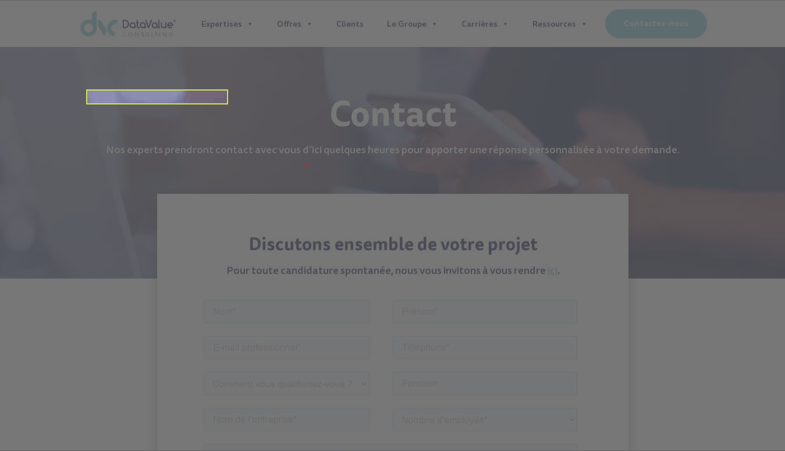
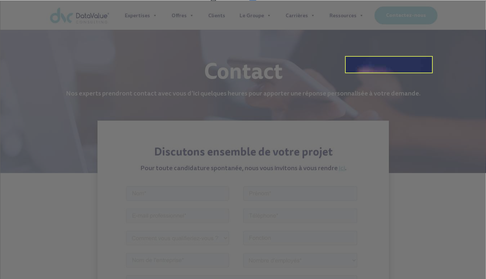
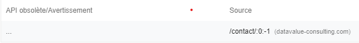
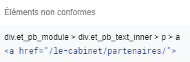
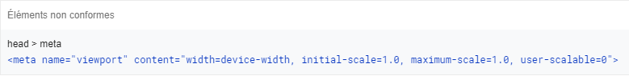
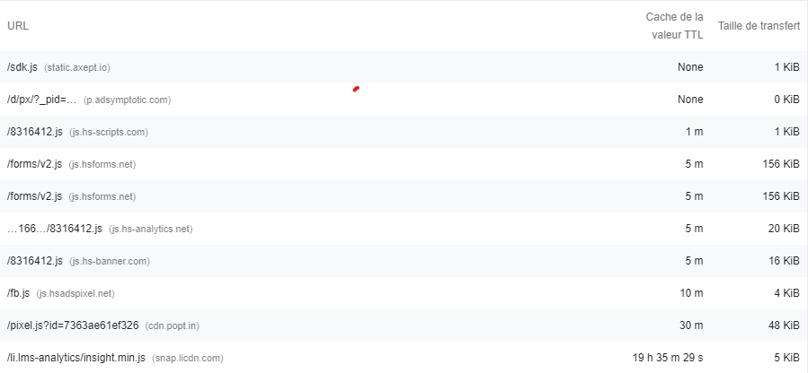

# SEO
## Exploration et Indexation

* Certains Les liens ne peuvent pas être explorés :

    ```sh
    li#mega-menu-item-29946 > ul.mega-sub-menu > li#mega-menu-item-29954 > a.mega-custom-icon
    <a class="mega-custom-icon mega-menu-link" tabindex="0">
    ```
    

    ```sh
    Data<br>Valorisation
    <a class="mega-custom-icon mega-menu-link" tabindex="0" aria-label="Data<br>
    ```
    

# Bonnes pratiques
## Général
* API obsolètes utilisées

    ```sh
    Les API obsolètes seront finalement supprimées du navigateur
    ```
    


# Accessibilité
## Navigation
* Les éléments d'en-tête ne sont pas classés séquentiellement par ordre décroissant

    ```sh
    Les en-têtes correctement classés qui respectent les niveaux transmettent la structure sémantique 
    de la page, ce qui garantit une navigation plus aisée et 
    permet d'identifier plus facilement dans quels cas utiliser les technologies d'assistance.
    ```
    
    

## Noms et Etiquettes
* Les liens n'ont pas de nom visible

    ```sh
    Rédigez du texte visible et unique pour les liens (et pour le texte de substitution des images, 
    si vous vous en servez dans des liens), afin que les utilisateurs de lecteurs d'écran puissent 
    facilement positionner le curseur dessus et bénéficient d'une meilleure expérience de navigation
    ```
    

## Bonnes Pratiques
* L'attribut [user-scalable="no"] est utilisé dans l'élément <meta name="viewport">, ou l'attribut [maximum-scale] est inférieur à 5.

    ```sh
    La désactivation de la fonction de zoom peut être problématique pour les utilisateurs 
    qui ne voient pas bien et qui ont besoin d'agrandir le contenu d'une page Web pour en saisir le sens    
    ```
    

# Performances
## Diagnostic
* Diffusez des éléments statiques grâce à des règles de cache efficaces 

    ```sh
    Une longue durée de vie du cache peut accélérer les visites répétées sur votre page
    En savoir plus sur la mise en cache dans le navigateur dans WordPress
    ```
    

# Divers
* Problème de page (chargement d'un page qui ne devrait pas) lorsqu'on clic sur "Le Groupe"